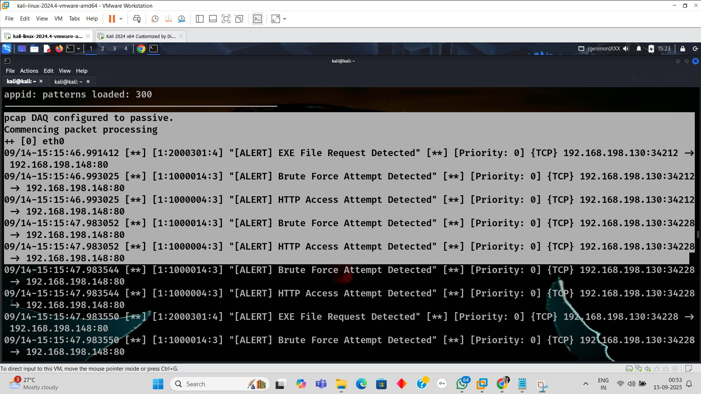

# 🚀 Snort NIDS — Custom Rules & Test Playbook

**Author:** Dip Kar — Intern @ Infotact Solution  
**License:** MIT

> ⚠️ Use only in a lab or on systems where you have explicit permission. Unauthorized scanning or attack simulation is illegal.

## Short intro
This repository contains an advanced Snort++ (Snort 3) based Network Intrusion Detection System (NIDS) setup created as an internship project at Infotact Solution. It includes a Snort configuration, 35 custom detection rules for common web/network attacks, and a full test playbook (attacker/victim commands) with a final internship report.

## ✨ Features
- 35 custom Snort++ rules covering:
  - SQL Injection (basic & encoded payloads)
  - Cross-Site Scripting (XSS) raw & encoded
  - Reconnaissance & scans (Nmap SYN, XMAS, aggressive scans)
  - Brute-force and authentication attempts (SSH, FTP, HTTP)
  - Malware detection (EXE requests / MZ payload)
  - Webshell upload detection (.php, .asp, .jsp)
  - DoS/DDoS and UDP attack detection
- Configurable `snort.lua` (set `HOME_NET` for your lab)
- Full reproducible test playbook in PDF (`docs/SNORT_NIDS_Project_REPORT.pdf`)
- Contributors & credits file included
- Easy to run from a lab VM/host with Snort installed

## 📂 Repo Structure
Snort-NIDS-Custom-Rules/
│── snort.lua                       # Snort++ configuration (rename/adjust HOME_NET)
│── rules/
│   └── local.rules                 # Custom rule set (35 rules)
│   └── RULES_SUMMARY.md            # Human readable SID + msg summary
│── docs/
│   └── SNORT_NIDS_Project_Report.pdf
│   └── screenshots/                # put alert screenshots here (examples)
│── tests/
│   └── run_sqli.sh                 # example test scripts
│── README.md
│── CONTRIBUTORS.md
│── LICENSE
│── .gitignore

## ⚙️ Setup (quick)
1. Use a Linux VM (Ubuntu/Debian recommended) with root/sudo access.  
2. Install Snort++ (Snort 3) and required dependencies — follow official Snort docs.  
3. Clone this repo:
   `git clone https://github.com/xatrarana/Network-Intrusion-Detection-System.git`
4. Edit `snort.lua` and set `HOME_NET` to your lab network (example: `192.168.198.0/24`).  
5. You may either copy `rules/local.rules` to your system Snort rules folder or run Snort directly pointing to this repo config.

## ▶️ Run (example)
Start Snort in console alert mode (fast format):  

sudo snort -c /etc/snort/snort.lua -i eth0 -A alert_fast

## 📸 Screenshots

Below are example alert screenshots (click to view on GitHub):

- 
- 
- 
- 
- 
- 
- 
-  Detected.jpg)
- 
- 
- 
- 
- 
- 
- 
- 
- 
- 
- 
- 
- 
- 
- 
- 
- 
- 
- 
- 
- 
- 
- 
